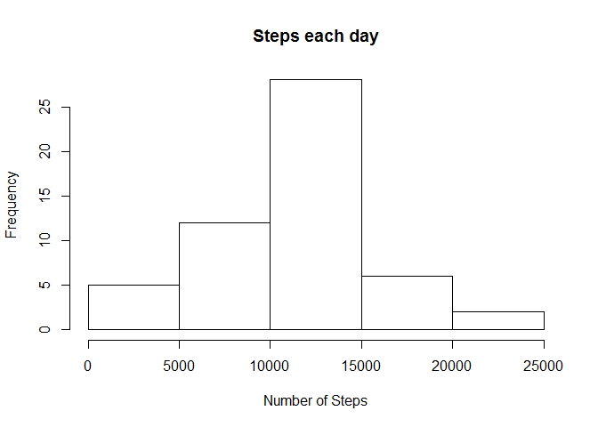
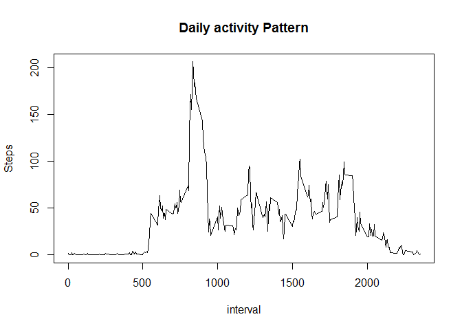
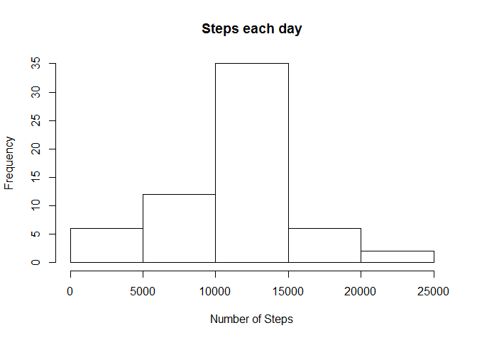
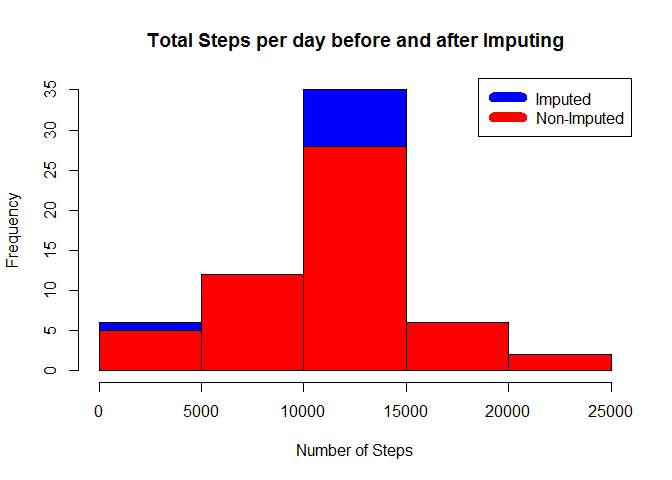

# Reproducible Research: Peer Assessment 1


## Loading and preprocessing the data


```r
#Unzip the Actidity Zip file and Read the csv
activitydata <- read.csv(unzip("activity.zip", "activity.csv"))
```


## What is mean total number of steps taken per day?


```r
#Histogram of Steps per Day, Mean and Median values
stepsperday <- aggregate(steps ~ date, activitydata, sum)
hist(stepsperday$steps, main="Steps each day",xlab="Number of Steps")
```

<!-- -->

```r
meansteps <- mean(stepsperday$steps)
mediansteps <- median(stepsperday$steps)
```
The mean of total number of steps taken per day is 1.0766189\times 10^{4}  
The median of total number of steps taken per day is 10765

## What is the average daily activity pattern?

```r
stepsperinterval <- aggregate(steps ~ interval, activitydata, mean )
plot(stepsperinterval$interval,stepsperinterval$steps,type="l",
     xlab="interval",ylab = "Steps",
     main = "Daily activity Pattern")
```

<!-- -->

```r
maxinterval <- stepsperinterval[which.max(stepsperinterval$steps),1]
```
The maximum number of steps for a 5 minute interval is 206  
The 5-minute interval which had maximum number of steps was 835


## Imputing missing values


```r
#Find all missing cases and impute missing values with average of interval across all days
incomplete <- sum(!complete.cases(activitydata))
imputed_activitydata <- transform(activitydata,
                          steps = ifelse(is.na(activitydata$steps),        stepsperinterval$steps[match(activitydata$interval, stepsperinterval$interval)],activitydata$steps))
#Impute day 1 steps to 0.
imputed_activitydata[as.character(imputed_activitydata$date) == "2012-10-01",1 ] <- 0

#Recalculate total steps per day and create histogram
stepsperday_imp <- aggregate(steps ~ date, imputed_activitydata, sum)
hist(stepsperday_imp$steps, main="Steps each day",xlab="Number of Steps")
```

<!-- -->

```r
#calculate new mean and median
meansteps_imp <- mean(stepsperday_imp$steps)
mediansteps_imp <- median(stepsperday_imp$steps)

#difference between imputed and non imputed data
meandiff <- meansteps_imp - meansteps
mediandiff <- mediansteps_imp - mediansteps

#Create Histogram to show diff
hist(stepsperday_imp$steps, main="Total Steps per day before and after Imputing", col="blue" , xlab="Number of Steps")
hist(stepsperday$steps, main = "Total Steps per day before and after Imputing", col="red", xlab="Number of Steps", add=T)
legend("topright", c("Imputed", "Non-Imputed"), col=c("blue", "red"), lwd=10)
```

<!-- -->

```r
#Calculate total difference.
total_diff <- sum(stepsperday_imp$steps) - sum(stepsperday$steps)
```
The new mean of imputed data is 10589 against old mean value of 10766.  
The difference in mean is -176  
The new median of imputed data is 10766 against old mean value of 10765.  
The difference in median is 1   
Overall shape of distribution has not changed.


## Are there differences in activity patterns between weekdays and weekends?

```r
weekdays <- c("Monday","Tuesday","Wednesday","Thursday","Friday")
imputed_activitydata$dayofweek = as.factor(ifelse(is.element(weekdays(as.Date(imputed_activitydata$date)),weekdays), "Weekday", "Weekend"))
stepsperinterval_bydaytype_imp <- aggregate(steps ~ interval + dayofweek,imputed_activitydata,mean)

library(lattice)
xyplot(stepsperinterval_bydaytype_imp$steps ~ stepsperinterval_bydaytype_imp$interval|stepsperinterval_bydaytype_imp$dayofweek,
       main="Average Steps per Day by Interval",xlab="Interval",ylab="Steps",layout=c(1,2),type="l")
```

<!-- -->


